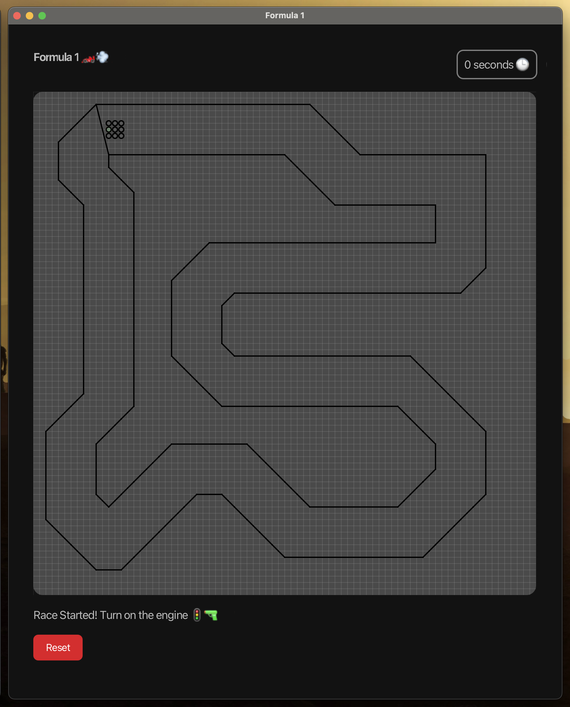
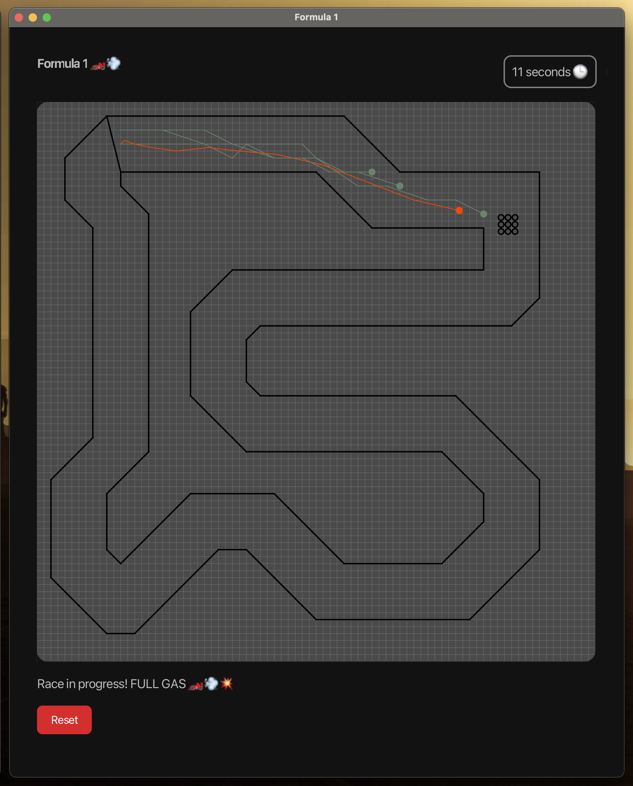

<!-- Improved compatibility of back to top link: See: https://github.com/othneildrew/Best-README-Template/pull/73 -->
<a name="readme-top"></a>
<!--
*** Thanks for checking out the Best-README-Template. If you have a suggestion
*** that would make this better, please fork the repo and create a pull request
*** or simply open an issue with the tag "enhancement".
*** Don't forget to give the project a star!
*** Thanks again! Now go create something AMAZING! :D
-->


<!-- PROJECT SHIELDS -->
<!--
*** I'm using markdown "reference style" links for readability.
*** Reference links are enclosed in brackets [ ] instead of parentheses ( ).
*** See the bottom of this document for the declaration of the reference variables
*** for contributors-url, forks-url, etc. This is an optional, concise syntax you may use.
*** https://www.markdownguide.org/basic-syntax/#reference-style-links
-->
[![Contributors][contributors-shield]][contributors-url]
[![Forks][forks-shield]][forks-url]
[![Stargazers][stars-shield]][stars-url]
[![Issues][issues-shield]][issues-url]
[![MIT License][license-shield]][license-url]
[![LinkedIn][linkedin-shield]][linkedin-url]


<!-- ABOUT THE PROJECT -->
## Formula 1 🏎️💨


Formula1 is a JavaFx desktop application that allows users to recrate the old [paper and pencil vector rally](https://en.wikipedia.org/wiki/Racetrack_(game))
 
 - The application allows user to start a game and play against 3 bots.
 - The application keep track of the time (in seconds) elapsed from the beginning of the race.
 - A race only have one lap.
 - Both bots paths and track can be uploaded via json files.

<p align="right">(<a href="#readme-top">back to top</a>)</p>


### Built With

 <a href="https://java.com" target="_blank" rel="noreferrer">  </a>

<p align="right">(<a href="#readme-top">back to top</a>)</p>


<!-- ROADMAP -->
## Examples <a name="examples"></a>
   

- [ ] To start a new game just move the player in one of the near 8 buttons available to make it move.
      
- [ ] The game follows the rules of the original vector rally:

   - Each turn you can speed up (accelerate), slow down (decelerate) or maintain the same speed. When you accelerate from the starting point (the gray cross on the left), you start by moving 1 square. The next turn you move 2 squares, then squares, and so on. So when accelerating you increase the number of squares by 1 each turn.
     
   -  When decelerating you do the opposite, you decrease the number of squares by 1 each turn. So when you move 5 squares, the next turn you move 4 squares, then 3, and so on, until you come to a stop. You can also choose to maintain the same speed by moving the same number of squares as on the previous turn.
     
 - [ ] If a player goes above the limit of the track, it is consider a crash and the game will restart.
       
 - [ ] The first player taht make a lap win the race and the game restart itself.
       
 - [ ] The user can easly force restart the game by pressing the red button.

See the [open issues](https://github.com/fres-sudo/formula1/issues) for a full list of proposed features (and known issues).

<p align="right">(<a href="#readme-top">back to top</a>)</p>

<!-- GETTING STARTED -->
## Getting Started

Follow these steps to setup the project locally on your machine.

### Prerequisites

For a correct installation of the project make sure to have both [Java](https://www.java.com/) and [Gradle](https://gradle.org/install/) installed on your local machine. 
These are the minimum version required for the project:

> JVM 21+
> 
> Gradle 8.5+

To check the correct installation of both software please run:

```sh
  gradle --version
```

### Installation

1. Clone the repo
   ```sh
   git clone https://github.com/fres-sudo/formula1.git
   ```
2. Build the project
   ```sh
   gradle build
   ```
3. Run the project 
   ```sh
    gradle run
   ```

<p align="right">(<a href="#readme-top">back to top</a>)</p>


<!-- CONTRIBUTING -->
## Contributing

Contributions are what make the open source community such an amazing place to learn, inspire, and create. Any contributions you make are **greatly appreciated**.

If you have a suggestion that would make this better, please fork the repo and create a pull request. You can also simply open an issue with the tag "enhancement".
Don't forget to give the project a star! Thanks again!

1. Fork the Project
2. Create your Feature Branch (`git checkout -b feature/AmazingFeature`)
3. Commit your Changes (`git commit -m 'Add some AmazingFeature'`)
4. Push to the Branch (`git push origin feature/AmazingFeature`)
5. Open a Pull Request

<p align="right">(<a href="#readme-top">back to top</a>)</p>


<!-- LICENSE -->
## License

Distributed under the MIT License. See `LICENSE.txt` for more information.

<p align="right">(<a href="#readme-top">back to top</a>)</p>


<!-- CONTACT -->
## Contact

 - 📬 Email: francescocalicchio@hotmail.com
 - 👤 Linkedin: [francesco-calicchio](https://www.linkedin.com/in/francesco-calicchio/)
 
Project Link: [https://github.com/fres-sudo/formula1](https://github.com/fres-sudo/formula1)

<p align="right">(<a href="#readme-top">back to top</a>)</p>


<!-- MARKDOWN LINKS & IMAGES -->
<!-- https://www.markdownguide.org/basic-syntax/#reference-style-links -->
[contributors-shield]: https://img.shields.io/github/contributors/fres-sudo/formula1.svg?style=for-the-badge
[contributors-url]: https://github.com/fres-sudo/formula1/graphs/contributors
[forks-shield]: https://img.shields.io/github/forks/fres-sudo/formula1.svg?style=for-the-badge
[forks-url]: https://github.com/fres-sudo/formula1/network/members
[stars-shield]: https://img.shields.io/github/stars/fres-sudo/formula1.svg?style=for-the-badge
[stars-url]: https://github.com/fres-sudo/formula1/stargazers
[issues-shield]: https://img.shields.io/github/issues/fres-sudo/formula1.svg?style=for-the-badge
[issues-url]: https://github.com/fres-sudo/formula1/issues
[license-shield]: https://img.shields.io/github/license/fres-sudo/formula1.svg?style=for-the-badge
[license-url]: https://github.com/fres-sudo/formula1/blob/master/LICENSE.txt
[linkedin-shield]: https://img.shields.io/badge/-LinkedIn-black.svg?style=for-the-badge&logo=linkedin&colorB=555
[linkedin-url]: https://linkedin.com/in/francesco-calicchio
[product-screenshot]: images/screenshot.png
[Next.js]: https://img.shields.io/badge/next.js-000000?style=for-the-badge&logo=nextdotjs&logoColor=white
[Next-url]: https://nextjs.org/
[React.js]: https://img.shields.io/badge/React-20232A?style=for-the-badge&logo=react&logoColor=61DAFB
[React-url]: https://reactjs.org/
[Vue.js]: https://img.shields.io/badge/Vue.js-35495E?style=for-the-badge&logo=vuedotjs&logoColor=4FC08D
[Vue-url]: https://vuejs.org/
[Angular.io]: https://img.shields.io/badge/Angular-DD0031?style=for-the-badge&logo=angular&logoColor=white
[Angular-url]: https://angular.io/
[Svelte.dev]: https://img.shields.io/badge/Svelte-4A4A55?style=for-the-badge&logo=svelte&logoColor=FF3E00
[Svelte-url]: https://svelte.dev/
[Laravel.com]: https://img.shields.io/badge/Laravel-FF2D20?style=for-the-badge&logo=laravel&logoColor=white
[Laravel-url]: https://laravel.com
[Bootstrap.com]: https://img.shields.io/badge/Bootstrap-563D7C?style=for-the-badge&logo=bootstrap&logoColor=white
[Bootstrap-url]: https://getbootstrap.com
[JQuery.com]: https://img.shields.io/badge/jQuery-0769AD?style=for-the-badge&logo=jquery&logoColor=white
[JQuery-url]: https://jquery.com 
